# Weekly progress journal

This README file is a Weekly progress journal of the project. The weekly progress journal is a tool that we used in our gitlab repo as a was of continuous assesment, as well as to keep track of the whole project as a team. In this repo you can find all the code developed for the Project 2 of the Computational Physics course (AP3082 of the Applied Physics Master programme at TU Delft). The project is about estimating the ground state energy of the Helium atom using *Variational Quantum Monte Carlo*. You can find more details in the report of the project CP_Project_2.pdf.

## Instructions

In this journal you will document your progress of the project, making use of the weekly milestones.

Every week you should 

1. write down **on the day of the lecture** a short plan (bullet list is sufficient) of how you want to 
   reach the weekly milestones. Think about how to distribute work in the group, 
   what pieces of code functionality need to be implemented.
2. write about your progress **until Monday, 23:59** before the next lecture with respect to the milestones.
   Substantiate your progress with links to code, pictures or test results. Reflect on the
   relation to your original plan.

We will give feedback on your progress on Tuesday before the following lecture. Consult the 
[grading scheme](https://computationalphysics.quantumtinkerer.tudelft.nl/proj1-moldyn-grading/) 
for details how the journal enters your grade.

Note that the file format of the journal is *markdown*. This is a flexible and easy method of 
converting text to HTML. 
Documentation of the syntax of markdown can be found 
[here](https://docs.gitlab.com/ee/user/markdown.html#gfm-extends-standard-markdown). 
You will find how to include [links](https://docs.gitlab.com/ee/user/markdown.html#links) and 
[images](https://docs.gitlab.com/ee/user/markdown.html#images) particularly.

## Week 1
In this week we tried to implement the first step of the Monte Carlo Method: computation of the expected value of the energy using Metropolis algorithm

To do so we

* Built the fucntions for the psi expression of the wavefunction ansatz for the Hydrogen case.
* Built the fucntions for the eloc (local energy) expression of the wavefunction ansatz for the Hydrogen case.
* Built a metropolis walk funciton that tracks the positions walk during the process of Metropolis random position walk.
* Used these functions to obtain the energy of an electron of a Hydrogen atom using several Metropolis walks.

For the upcoming week we plan to

* Migrate the fucntions into a separate file to call them in the main.
* Apply the variation of parameters to actually minimize the different energies obtained (vary the 'c' value in the case of Hydrogen atom).
* Try to implement the non-analytical Helium atom.

Extra work - update: 20:30 21/04/2022

To finish with the simulation for the Hydrogen atom, we will give some details about the results obtained.

1) First of all we checked that the Monte Carlo integration using the Metropolis algorithm worked correctly so we computed the expected value of the energy for some cases. We have used the wavefunction ansatz $`\psi = \sqrt{\frac{c^3}{\pi}}e^{-cr}`$, with $`c`$ the variational parameter and $`r=\sqrt{x^2+y^2+z^2}`$ (note that this wavefunction is normalized). According to literature (and the analytical solution), for $`c=1`$ we have the exact minimum value of the energy, which coincides with the measured one ($`\frac{-1}{2}`$ hartree) due to the correct shape of the chosen wavefunction. Indeed we observe that the energy value we obtain for $`c=1`$ is this exact value. We also observe that for the cases $`c=0.9`$ and $`c=1.1`$ we observe a value of the energy of around $`-0.49`$ hartree, which councides with the fact that for $`c=1`$ we have to find a minimum and the results given in Jos' book -chapter 12.2, pg. 402- (avaliable in the lecture notes). The variance observed in our case is grater than what the latter author obtains due to the fact that we sampled with ones single walker instead of 400 this time. We plan to increase the amount of walkers for our final results of the project. Therefore, we can conclude that our Metropolis funciton works correctly.

2) Secondly, we managed to implement the algorithm that computes the minimum parameter value of the algorithm $`c_{min}`$ on the fly (with some reaching-minimum-of-c-value criteria to be determined, by now it is just a for loop that loops over the algorithm depicted at Jos' book -chapter 12.2, pg. 399-). The approach was also taken from this latter mentioned piece of literature -chapter 12.2, pg. 404-. The value of the energy is taken as it follows:

    * Since each Metropolis call does the computation of the mean value fo the energy for a single walker, the final mean value of the energy is obtained by taking the mean over the mean values of the energy obtained by each walker. In a more pictoric way, we follow this path: We run the Metropolis function one time: walker goes to several different positions to compute 'instantaneous' values of the energy and then take the mean energy (for a single walker) -> we repeat this process for several amount of walkers -> we compute the \textbf{final mean energy by talking the mean over all the mean energies for single walkers. We observe that for the three steps that we run (this is, obtaining the final mean energy 3 times), the obtantion of the $`c`$ parameter and the mean energy value give:
    
        * $`c_{ini} = 1.2`$, $`E = -0.48 \pm \sqrt{0.3}`$ hartree
        * $`c = 1.007`$, $`E = -0.499 \pm \sqrt{0.007}`$ hartree
        * $`c = 1.00002`$, $`E = -0.49999 \pm \sqrt{0.00002}`$ hartree
    
    * We believe that we can conclude that the algorithm is correctly implemented since the minimum is satisfactory found. We would like to get two things checked. The first one is wether it is indeed correct to obtain the average value of the energy the way we do, this is, taking the mean value of the energy for every walker and then, for all walker's mean energy take their mean value a the final mean energy of the system. The second thing we wanted to ask about has to do with the $`\gamma`$ parameter in the expression for computing the next variational parameter on the fly in our computation (this is found in  formula (12.14) from Jos' -chapter 12.2, pg. 404-). We were wondering what value should it have (we have set it to $`1`$ by now) and what it represents, since we have not been able to find any reference of it in the text.
    
3) Finally, some work is being done in the code to be able to support an arbitrary number of degrees of freedom correctly (this is motivated by the fact that we need to go to the Helium case eventually). The migration of the functions into a separate '.py' file different from the main one also has to be done. The convergence of $``c`$ while loop will also be implemented in the following commits.

## Week 2

For week 2 we implemented the following improvements in the code:

1) The number of particles N was erased from all functions. The number of particles will therefore be incorporated in the number of dimensions from now on (i.e., #dimensions = (3 spatial dimensions) x (# of particles))

2) Dimension number was removed as an argument from the energies. Only the iterations are relevant for their calculation.

3) We altered the Metropolis function so that different number of walkers can be included. The number of walkers is given as an argument to the Metropolis function, which randomly initializes their positions and moves them around simultaneously in each iteration. The mean energy is finally given by taking the mean over the local energies of all walkers in all iterations.

Note 1: This Metropolis functions was built to only apply on the Hydrogen atom. For the Helium atom we will need to alter it.
Note 2: Increasing the number of walkers did not improve our results. This is because higher number of walkers are useful only when our sample contains regions of high probability in the configuration space which are seperated by unpenetratable regions of low probability. This is not the case in the Hydrogen atom. There is only one high probability region concentrated around r=0.

4) We created a function that given an arbitrary value for the parameter of the trial function, as an input, it computes the optimal value of the parameter (the one that minimizes the expectation value of the energy). This function came in two versions: one that has a fixed number of -for loops to perform the computations, and another that utilizates a condition for the variation of the mean energy, which has to become smaller than 0.01 for the -while loop to stop.
We obtained very satisfactory results. For example for an initial value of c=6 for the parameter, the optimization function ("hydr_opt") managed to converge to the actual value of 1.0 with precision 0.01 after only 3 loops. The plot of the parameter after each loop has been uploaded under the name "01Hydrogen_Parameter_Value_Optimization". For this value of the parameter we also plotted the energy graph of a walker per iteration ("02Hydrogen_Walkers_Energy_per_Iteration").

Note 3: All functions can be found in the file "functions.py" with detailed descriptions of their operations as comments
Note 4: Functions have been runned, results have been obtained and plots have been created, accompanied by comments, in the file "week2.py"

## Week 3

For week 3, we developed the autocorrelation function which can be found in functions.py. The autocorrelation function is a general function, meaning that if provided with a set of energies (or anything else) generated by different configurations (iterations) and different walkers, it can calculate the mean energy and variance no matter which system these energies correspond to. Thus, it can be used both for the Hydrogen and the Helium atom, we just have to generate the set of energies using the correspondingly adjusted Metropolis algorithms.

The most important aspect of the autocorrelation function though, is that, unlike what we did in previous weeks, it computes the variance not for statistically independent random data but for data that are **correlated**. Obviously, each energy measurement for each new configuration that is obtained by the Metropolis is somewhat correlated to the previous configuration so we need to take that into account.

The results we receive this way are more satisfying than in previous calculations. More precisely, for the Hydrogen atom and for the parameter adjusted to c = 1.1, we consistently find energies around -0.495 with a variance of 0.002. This fits perfectly within the limits mentioned in literature. We just remind that the variance we used to find for **uncorrelated** data was 0.1, that is 50 times higher.

In the following figures we plot the autocorrelation function vs the iterations, of a Hydrogen atom with a parameter c = 1.1, for 5 walkers which were placed in our configuration space and were let to move around simultaneously. We also write down the energy that they computed and the variance (averaged over all walkers). Then, for comparisonm we provide the results found in literature:

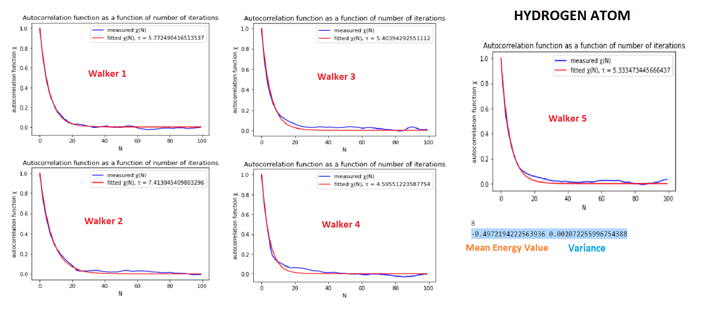
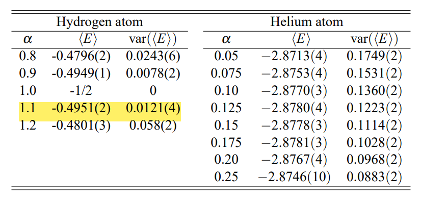

We now continue by adjusting all functions to the Helium atom:

1) We define the functions:

**i) psi_helium(c, r1, r2):** Function that takes as arguments a parameter c and two matrices r1, r2 corresponding to the vector positions of electron 1 and electron 2 as measured by different walkers (spatial coordinates --> along the line, different walkers --> different lines), and returns the values (1D array) of the test-wavefunction (the one given at the book) for this set of different configurations of different walkers.

**ii) eloc_helium(c, r1, r2, sp_dim):** Function that computes the value of the local energy that corresponds to different walkers (also takes the spatial dimensionality as argument, now since there are 2 electrons, the total number of dimensions in our configuration sapce is twice as much as the number of spatial dimensions) --> 2D array

**iii) derivative_psi_c_helium(c, r1, r2):** Function that given the positions of the electrons and the parameter c returns the quantity 
dln(ψ(R))/dc, which is meant to be used for finding the optimal value of the parameter c (e.g., the one that minimizes the energy)

**Note that in all calculations we do not normalise our test wavefunction. This is not required since the normalization constant cancels out for all calculations we carry out**

2) We adjust the **Metropolis function** to the Helium atom: 

Not much change compared to the hydrogen atom. The function takes as arguments the parameter c, the number of iterations we want to carry out, the number of walkers and the dimensionality of our configuration space. Then it creates a random configuration in our 6D space spanning from -2 to +2 for all coordinates (twice as big lengths and dimensionality as in the hydrogen case). This configuration corresponds to the initial positions of the 2 electrons each walker sees. Then, we plug half of this position-matrix to r1 and the other half to r2 and we let the Metropolis algorithm run and create other configurations.

The value of the parameter d (distance per coordinate that we move from each preceding configuration) was 1 for the hydrogen atom. In the following picture we present how different coordinates (x1, y1, z1, x2, y2, z2) of different walkers move around as the algorithm runs for such a value of d in the Helium case:

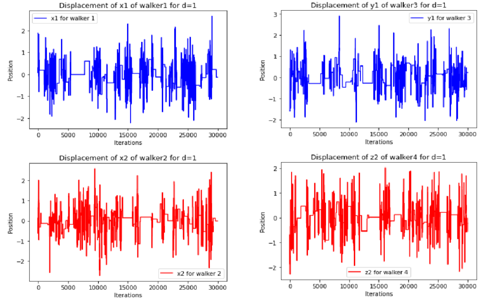

We observe that for d=1 the walkers stick to one configuration for very many steps which is not what we want. We thus adjust d in different values until he obtain a satisfactory picture for **d=0.2:**

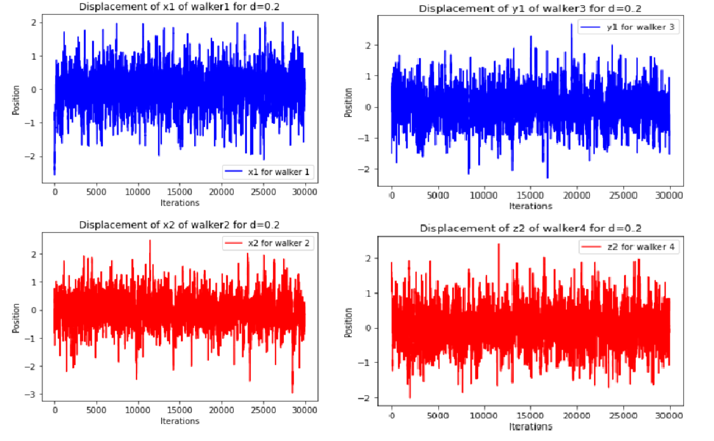

The validity of these pictures, as well as the suitability of the value d=0.2 for the parameter d, are further justified by the acceptance ratios we obtain for different values of d:

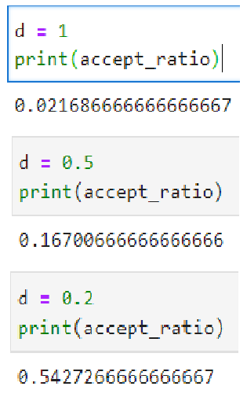

We see that for d=0.2 the acceptance ratio becomes ~ 0.5 which is what we aim for.

3) Now that the Metropolis function is adjusted, we continue by defining the **mean_energy_helium1(c, iterations, walkers, dim)** function. This function, provided the parameter c, calls the Metropolis function and generates matrices corresponding to different observables that emerge from the trial-wavefunction with this parameter. These observables include the local energy, the positions and other quantities needed for the optimization. They come in 2D matrices because they are stored for every iteration (lines) and for every walker (columns).

Given these matrices, the mean values of the observables are found over all iterations (after step 4000) and all walkers. In the case of energy we also compute the variance in two ways: variance1 corresponding to the variance over all different configurations (for different steps AND different walkers), while variance2 computes the variance between the mean energies each walker computes. Weirdly enough this different computations lead to the same results for the variance as it will become more clear later.

**Note that for mean_energy_helium1 function, both variance computations are carried out assuming that different configurations generated by the Metropolis algorithm are statistically independent (i.e., uncorrelated). This is not entirely true since in each step, the new configuration is generated by taking into account the preceding configuration.**

In the picture bellow we present the results aquired manually for different values of the parameter c, compared to the values of the literature:

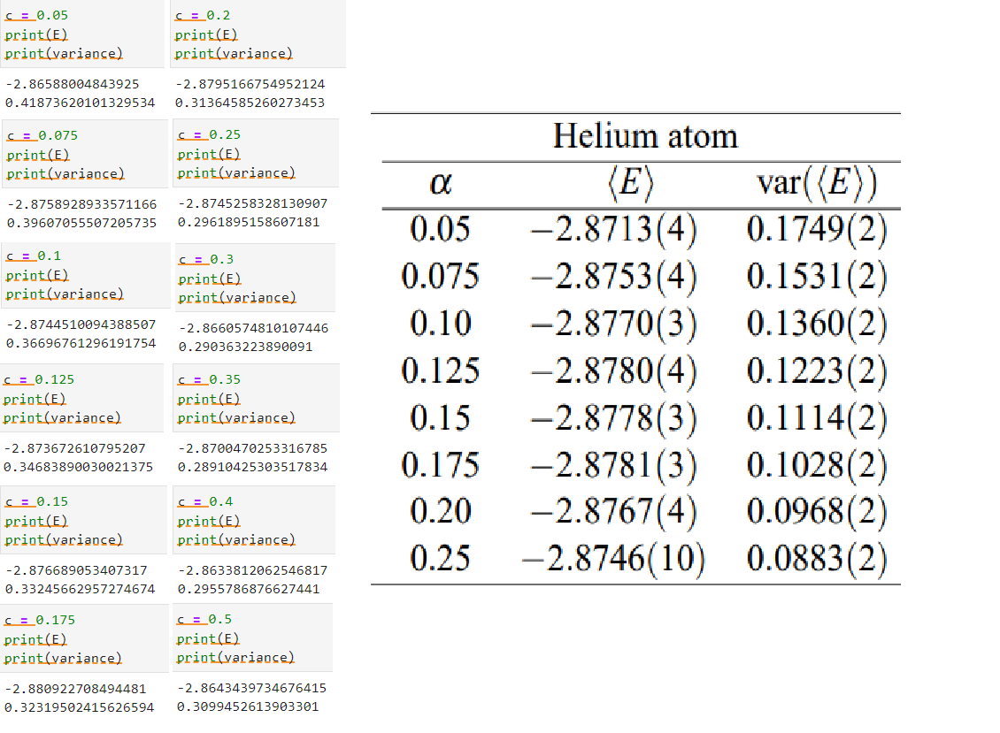

We observe that the minimum of the energy is obtained at **c = 0.175**, just like in literature, with a value of **-2.8809**, very close to the respective of the literature (**-2.8781**). It is also visible that the values of the mean energy for different values of the parameter we find are also suprisingly close to these of the literature and follow the same patterns.

On the other hand, the variance we obtain, although following the same pattern over different parameters as in literature, it is constantly larger in magnitude (2.5 - 3.5 times).

4) And know we move to the function that finds the optimal value for the parameter c. This is done by **helium_opt1(c, walkers, dim)**. This function, given an initial c, utilizes the mean values obtained via mean_energy_helium1 and computes the optimal value of c after a sequence of steps as described in the book. In our functions we use an adjustable condition for the minimum variance we ought for. Also we set a maximum number of steps (100) to be taken if the condition cannot be fulfilled.

We obtain the following plots:

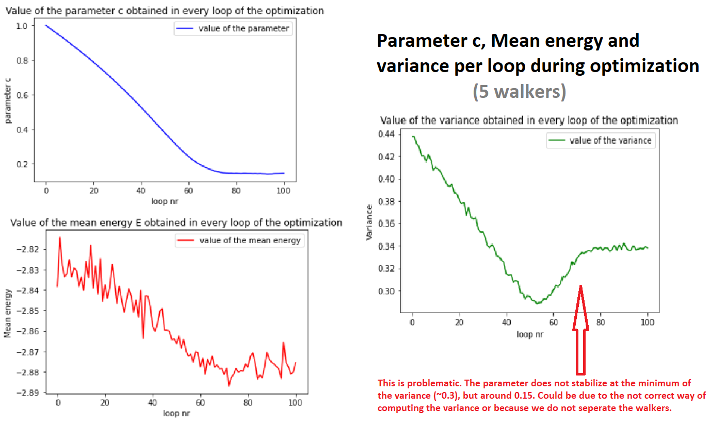

In this plot, given an initial value c = 1 to the parameter, we observe its evolution step by step during the optimization process. Likewise, we see the values of the energy and the variance over the same process.
As expected, the value of the parameter drops continually in every step and stabilizes around 0.175. We see that the energy also stabilizes around a minimum of -2.88.
What was not expected though, but also appears in the results given in the book, is that the minimum of the variance does not occur for the same value of the parameter as the minimum of the energy. We see in the third graph of the figure that the variance reaches a minimum around the 50th step, and then starts rising as the energy continues to drop.

This mismatch between the two minima is displayed better in the following plot:

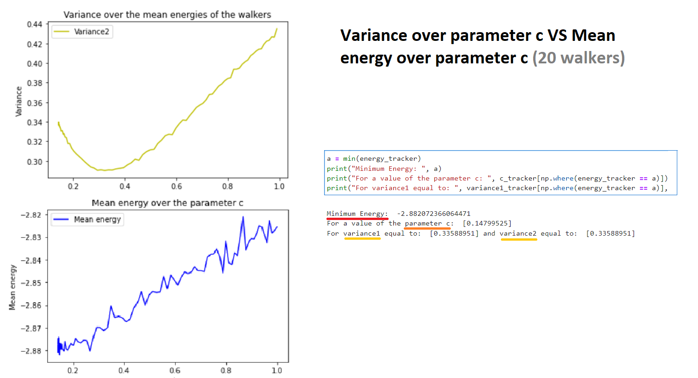

Here we display the values of the energy and variance over different values of the parameter. It is evident that although the minimum of the energy is reached for c ~ 0.15, the minimum of the variance is reache for c ~ 0.33. We interpret this mismatch as a result of computing the variance as if the different configurations are uncorrelated.

We also mentioned that we compute the variance in two different ways. WHy do we mention just one variance in this results?
Because, as it is clear in the following figure, these two different computations of the variance lead to identical results:

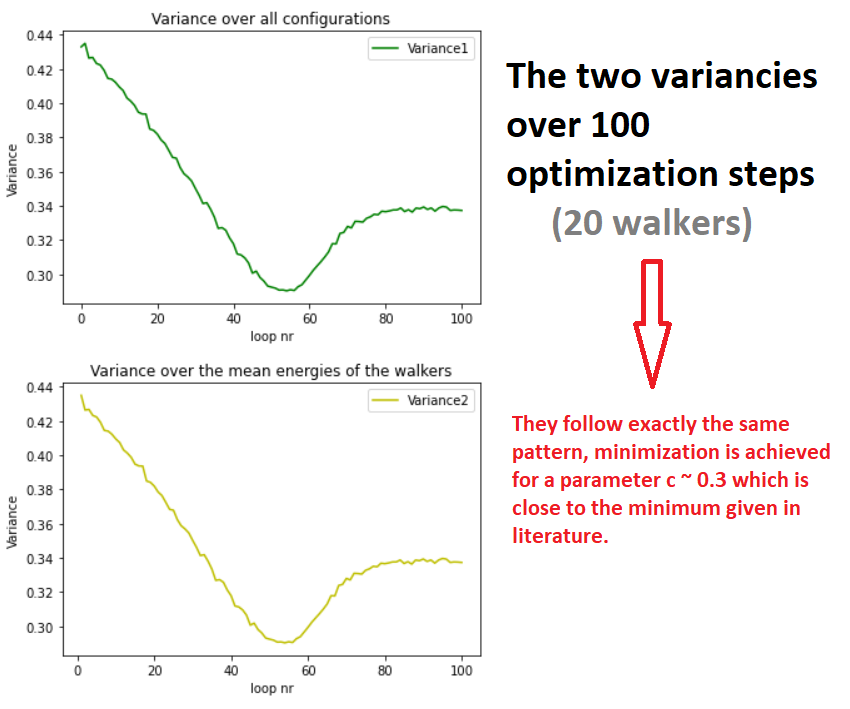

.
.

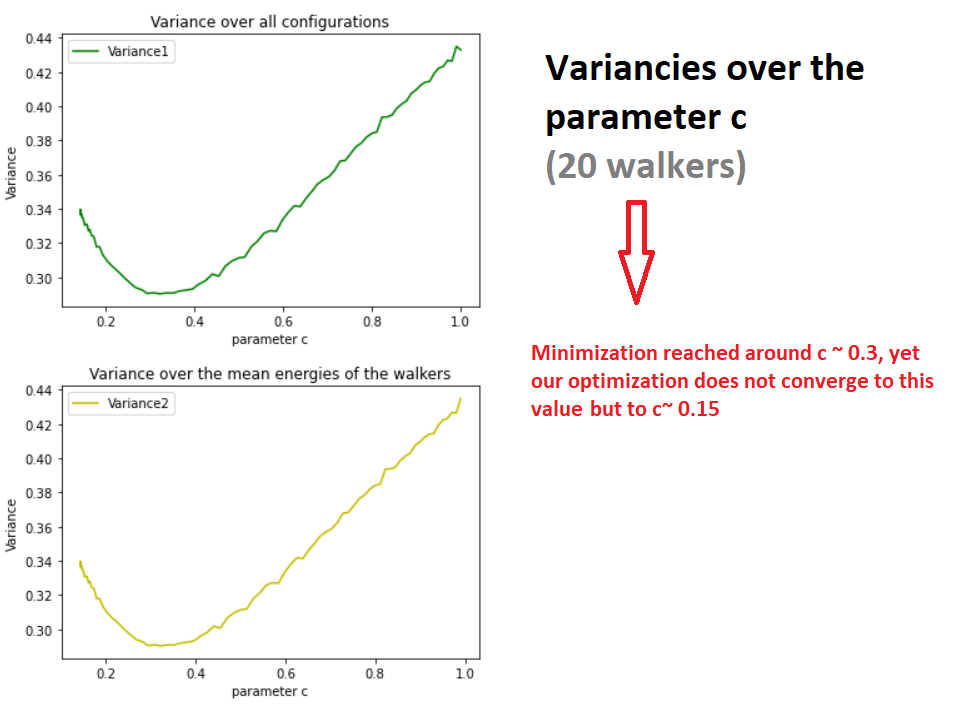

5) Seeing the odd behaviour of the variance we felt the urge to define a new function to compute it. We basically just used the pre-existing autocorrelation function adjusted to work in this case (see **autocorrelation2(A, walkers)** in functions1.py). This functions given a 2D matrix A (=energy_tracker, variation_expectation etc) computes its mean and its variance but **adjusted to statistically correlated data** (for more details see the descriptions of the functions and the comments in "autocorrelation2(A, walkers)" and "autocorrelation1(A, walkers)" in the function1 file, as well as week3.py). 
Here we also compute the variance in two different ways. Just like before: over all existing configurations (variance1) and over the already averaged energies (for different iterations) of different walkers (variance2). Now these two variances vary a bit but follow the same pattern.

To include this computation in our functions we had to modify the mean energy and the optimization functions accordinly. Thus, we created **mean_energy_helium3(c, iterations, walkers, dim)** and **helium_opt2(c, walkers, dim)**.

The results acquired are showed in the following tables:

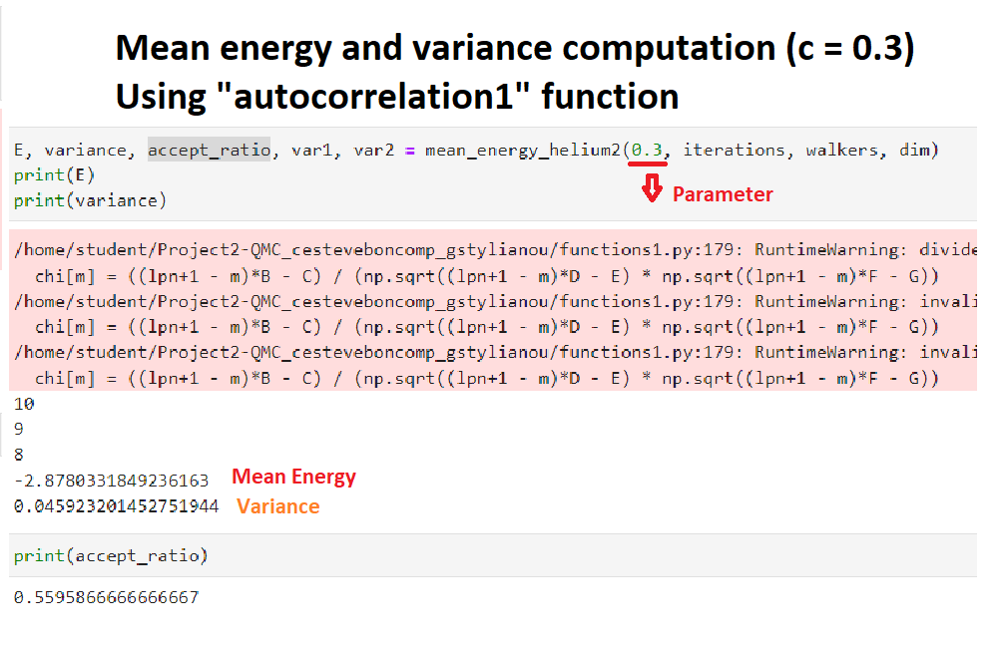
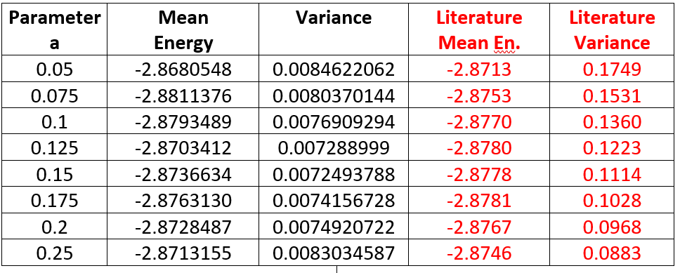

It is clear that the variance (variance1 here) is now much smaller compared to that for uncorrelated data. It is also much smaller than that given in literature.
Likewise, both variance1 and variance2, exhibit the same behaviour over different values of the parameter, **which is though different to that of the literature and for uncorrelated data**. This can be seen in the plots bellow:

")
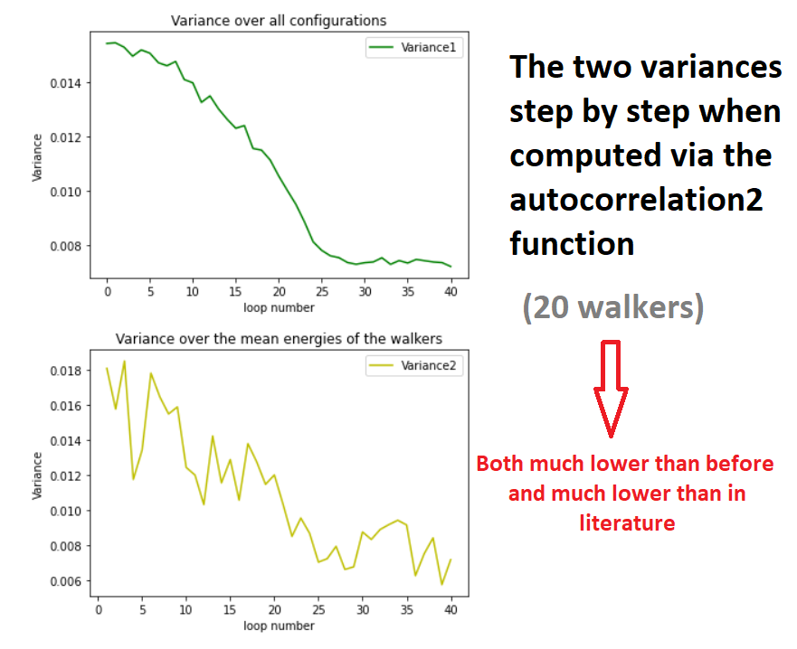

It can be seen now, that during the optimization process, the parameter again converges to 0.175. This time though, the variance follows the minimization of the energy as the optimization carries on (2nd plots) and both variances drop in close correspondance to the energy.

This becomes more clear in the next plot showing the energy and the variance dependance on the parameter:

")

We see again that the mimima of the energy and the (correlated) variance lies between c ~ 0.15 and c ~ 0.175. 

Although, by treating the different configurations as sets of correlated data the variance drops to far lower values than those given in the book, the fact that they follow the minimization of the energy so closely and exhibit a better behaviour in general than that of uncorrelated data makes as believe that is a more proper way to compute the variance.

As for the energies we compute via the optimization of the parameter, we see that they converge very closely to the values found in literature under the best approximations (~ -2.90). 
